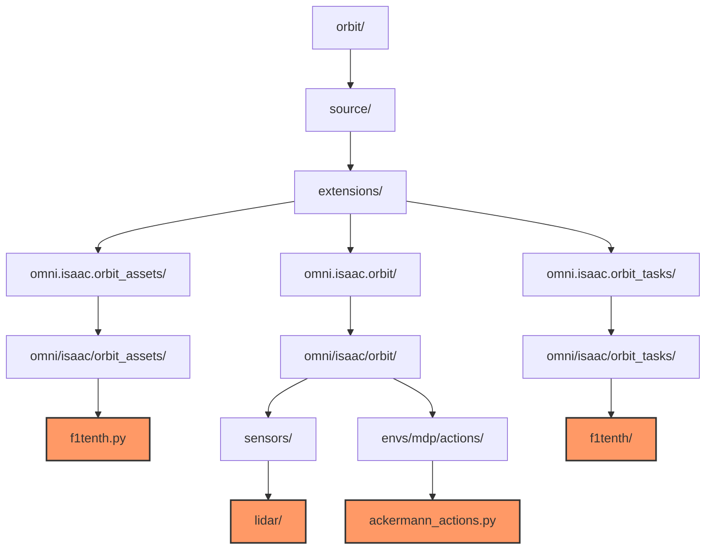
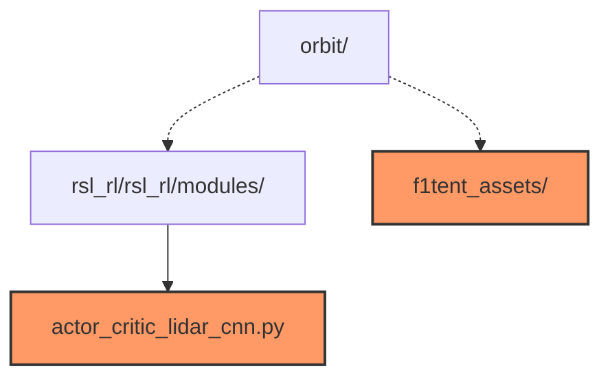

### Master Thesis in Computer Engineering
This repository contains the primary source code for the Master's thesis in Computer Engineering at Aarhus University, By Lukas Vindbjerg (201906015@post.au.dk) and Malthe Tøttrup (201907882@post.au.dk).

# Deep Reinforcement Learning for Autonomous Racing
The project focuses on training a deep reinforcement learning (DRL) agent for autonomous racing using the F1TENTH platform. It is based on the Orbit framework, a unified and modular framework for robot learning. Orbit simplifies workflows in robotics research, including RL. The project leverages NVIDIA Isaac Sim for fast and accurate simulation.

# Videos

You can find videos of training, inference testing, and deployment testing in the `videos/` directory.

- [Training](videos/Training.mp4)
- [Inference with Obstacles](videos/Inference_with_obstacles.mp4)
- [Inference on Real Track Built in Sim](videos/Real_Sim_Track.mp4)
- [Real-world Deployment](videos/Real_World.mp4)


## Project Directory Structure
The following describes the extensions made to the Orbit framework for the F1TENTH racing RL environment:

- **`f1tenth.py`**: Defines the robot interface.
- **`lidar/`**: Contains the LiDAR sensor API implementation.
- **`ackermann_actions.py`**: Defines the agent's actions based on Ackermann Control.
- **`f1tenth/`**: Contains the environment setup, including the MDP definition, observations, rewards, and actions for the F1TENTH racing environment.


A few submodules have been directly added to the repository to collect everything in one place. The `f1tenth_assets/` submodule contains the USD assets used in the project, such as the robot model and race tracks. The `actor_critic_lidar_cnn.py` contains the code for the developed LiDAR-based CNN architecture.


## Installation and Setup
It is recommended to use the docker setup by initializing the docker:
   
   ```bash
   docker/container.sh start
   ```
This requires the NVIDIA Container Toolkit to be installed on the host machine. It has been tested with Nvidia driver 535.171.04. The Docker setup will automatically install the required dependencies and set up the environment for the project.

You can also set up the environment manually by following the setup steps specified on the Orbit docs website: Isaac Lab Setup.

However, to use the LiDAR sensor in headless mode, you must add a dependency to Isaac Sim. Follow these steps:


1. Edit following file:

    ```bash
    gedit PATH_TO_ISAACSIM/isaac-sim/apps/omni.isaac.sim.python.gym.headless.kit
    ```

2. Add the following dependency to the bottom of the file.

    ```bash
    "omni.isaac.range_sensor" = {}
    ```
This will tell Isaac Sim to load the range sensor extension when the headless kit is loaded.

### Training the Agent
To train the reinforcement learning agent for the F1TENTH racing environment, use the following command:

Train commmand:
```
./orbit.sh -p source/standalone/workflows/rsl_rl/train.py --task F1tenth-v0 --headless --offscreen_render --num_envs 4096

```

- **`--task F1tenth-v0`**: Specifies the task environment for the training.
- **`--headless`**: Runs the simulation without rendering the GUI, which can speed up training.
- **`--offscreen_render`**: Enables offscreen rendering which is needed for the LiDAR.
- **`--num_envs`**: Specifies the number of parallel environments to be used for training.

### Running Inference
To run inference with a trained model, use the following example command:


```
./orbit.sh -p source/standalone/workflows/rsl_rl/play.py --task F1tenth-v0 --num_envs 16 --load_run 2024-05-16_14-38-55 --checkpoint model_999.pt
```


- **`--task F1tenth-v0`**: Specifies the task environment for the inference.
- **`--num_envs 16`**: Sets the number of environments for inference.
- **`--load_run 2024-05-16_14-38-55`**: Indicates the specific training run to load. Replace the date and time with the appropriate run identifier.
- **`--checkpoint model_999.pt`**: Specifies the checkpoint file to load the trained model. Replace `model_999.pt` with the path to the desired model checkpoint.

These commands will train and test your DRL agent within the F1TENTH environment using the Orbit framework. Make sure to replace the placeholders with your actual run identifiers and model checkpoints.

---

# Original `README.md`

The Original Orbit `README.md` is available [here](README_orbit.md).
